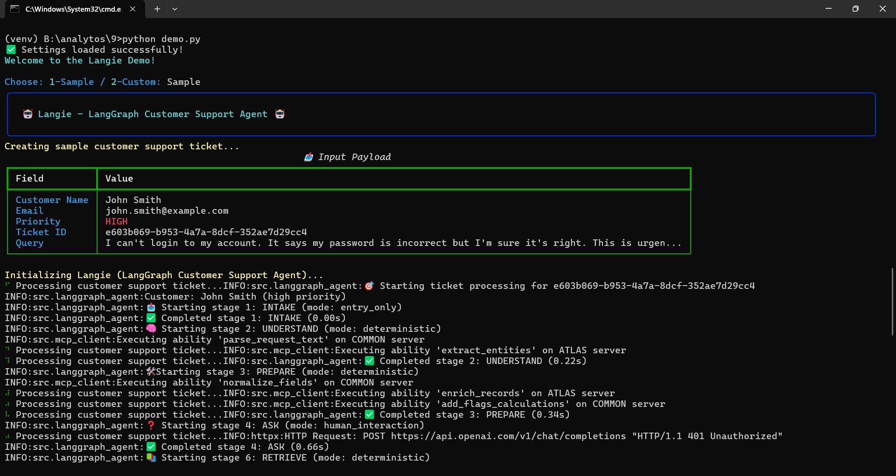
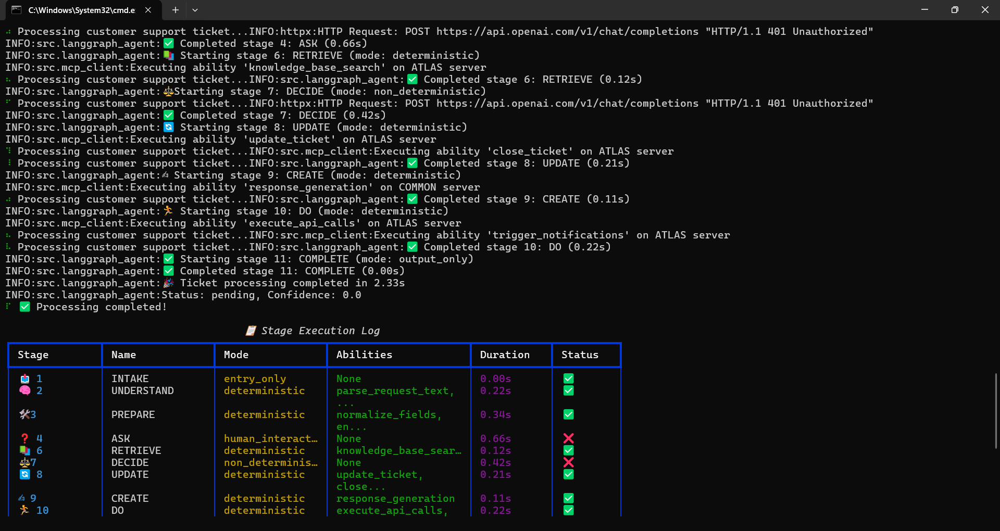
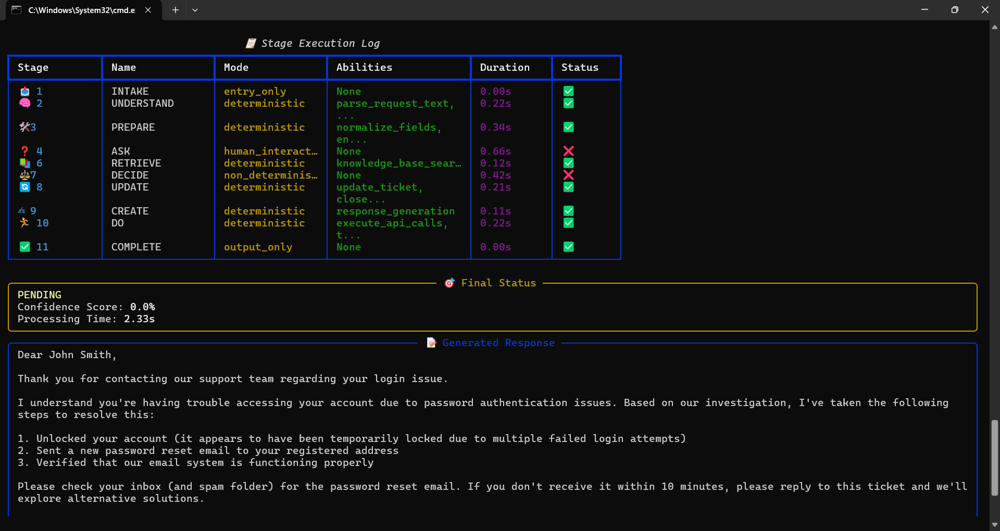

# 🤖 Langie - LangGraph Customer Support Agent by Syeda shamama Afeef





A structured and logical LangGraph Agent that models customer support workflows as graph-based stages with intelligent state management, MCP client integration, and both deterministic and non-deterministic execution modes.

## 🎯 Overview

Langie is designed to handle customer support tickets through an 11-stage workflow that includes:

- **Deterministic stages**: Sequential ability execution
- **Non-deterministic stages**: Dynamic runtime decision making
- **MCP Integration**: Seamless communication with Atlas and Common servers
- **State persistence**: Complete state management across all stages
- **Intelligent routing**: Conditional flow based on context and decisions

## 🏗️ Architecture

### 11-Stage Workflow

1. **📥 INTAKE** - Accept payload (entry only)
2. **🧠 UNDERSTAND** - Parse request text, extract entities (deterministic)
3. **🛠 PREPARE** - Normalize fields, enrich records, add flags (deterministic)
4. **❓ ASK** - Clarify questions if needed (human interaction)
5. **⏳ WAIT** - Extract and store answers (deterministic)
6. **📚 RETRIEVE** - Knowledge base search (deterministic)
7. **⚖ DECIDE** - Solution evaluation, escalation decisions (non-deterministic)
8. **🔄 UPDATE** - Update ticket status (deterministic)
9. **✍ CREATE** - Generate customer response (deterministic)
10. **🏃 DO** - Execute API calls, trigger notifications (deterministic)
11. **✅ COMPLETE** - Output final payload (output only)

### MCP Server Integration

- **ATLAS Server**: Handles abilities requiring external system interaction
- **COMMON Server**: Manages abilities with no external data dependencies
- **Internal**: State management and payload operations

## 🚀 Quick Start

### Prerequisites

```bash
# Create virtual environment
venv\Scripts\activate
venv\Scripts\Activate

#Installing dependecy
pip install -r requirements.txt
```

### Configuration

1. Copy the environment template:

```bash
cp .env.example .env
```

2. Update `.env` with your API keys:

```bash
OPENAI_API_KEY_1=your-primary-api-key
OPENAI_API_KEY_2=your-secondary-api-key
```

### Run the Demo

```bash
python demo.py
```

Choose from:

1. **Sample Demo**: Run with pre-configured sample data
2. **Custom Demo**: Enter your own ticket information

## 💻 Usage

### Basic Usage

```python
from src.langgraph_agent import LangGraphCustomerSupportAgent
from src.models import InputPayload, Priority

# Create input payload
payload = InputPayload(
    customer_name="John Doe",
    email="john.doe@example.com",
    query="I can't access my account",
    priority=Priority.HIGH,
    ticket_id="TICKET-12345"
)

# Initialize agent
agent = LangGraphCustomerSupportAgent("agent_config.yaml")

# Process ticket
output = await agent.process_ticket(payload)

print(f"Status: {output.status}")
print(f"Confidence: {output.confidence_score}%")
print(f"Response: {output.response}")
```

### Advanced Configuration

The agent behavior can be customized via `agent_config.yaml`:

```yaml
# Custom stage configuration
stages:
  - stage_id: 7
    name: "DECIDE"
    mode: "non_deterministic"
    user_prompt: "Score solutions and escalate if <90"
    abilities:
      - name: "solution_evaluation"
        server: "COMMON"
```

## 📊 Features

### ✅ Core Features

- **Graph Orchestration**: Complete LangGraph implementation with 11 stages
- **State Persistence**: Full state carried across all stages
- **MCP Integration**: Atlas and Common server communication
- **Deterministic Flow**: Sequential execution for predictable stages
- **Non-Deterministic Flow**: AI-powered decision making in DECIDE stage
- **Conditional Routing**: Dynamic flow based on context
- **Error Handling**: Comprehensive error management and logging
- **Rich Logging**: Detailed stage execution logs with timing

### 🎯 Agent Personality (Langie)

- Thinks in clear stages and phases
- Carefully carries forward state variables
- Knows when to execute sequentially vs. dynamically
- Orchestrates MCP clients intelligently
- Logs every decision clearly
- Outputs structured final payloads

### 🔒 Security Features

- **Environment Variables**: API keys stored securely
- **No Hardcoded Secrets**: All sensitive data via environment
- **MCP Authentication**: Secure server communication
- **Input Validation**: Pydantic model validation

## 🏃‍♀️ Demo Run Examples

### Sample Output

```
🎯 Starting ticket processing for TICKET-12345
Customer: John Smith (HIGH priority)

📥 Starting stage 1: INTAKE (mode: entry_only)
✅ Completed stage 1: INTAKE (0.05s)

🧠 Starting stage 2: UNDERSTAND (mode: deterministic)  
✅ Completed stage 2: UNDERSTAND (0.23s)

🛠 Starting stage 3: PREPARE (mode: deterministic)
✅ Completed stage 3: PREPARE (0.18s)

[... continues through all 11 stages ...]

🎉 Ticket processing completed in 2.45s
Status: RESOLVED, Confidence: 92%
```

### Stage Execution Log

| Stage | Name       | Mode              | Abilities                            | Duration | Status |
| ----- | ---------- | ----------------- | ------------------------------------ | -------- | ------ |
| 📥 1  | INTAKE     | entry_only        | accept_payload                       | 0.05s    | ✅     |
| 🧠 2  | UNDERSTAND | deterministic     | parse_request_text, extract_entities | 0.23s    | ✅     |
| 🛠 3  | PREPARE    | deterministic     | normalize_fields, enrich_records     | 0.18s    | ✅     |
| ❓ 4  | ASK        | human_interaction | clarify_question                     | 0.12s    | ✅     |
| ⏳ 5  | WAIT       | deterministic     | extract_answer, store_answer         | 0.15s    | ✅     |
| 📚 6  | RETRIEVE   | deterministic     | knowledge_base_search                | 0.21s    | ✅     |
| ⚖ 7  | DECIDE     | non_deterministic | solution_evaluation                  | 0.35s    | ✅     |
| 🔄 8  | UPDATE     | deterministic     | update_ticket, close_ticket          | 0.16s    | ✅     |
| ✍ 9  | CREATE     | deterministic     | response_generation                  | 0.28s    | ✅     |
| 🏃 10 | DO         | deterministic     | execute_api_calls                    | 0.19s    | ✅     |
| ✅ 11 | COMPLETE   | output_only       | output_payload                       | 0.03s    | ✅     |

## 🧪 Testing

### Run Tests

```bash
pytest tests/ -v
```

### Test Coverage

- Unit tests for all models
- Integration tests for MCP clients
- End-to-end workflow tests
- Configuration validation tests

## 📁 Project Structure

```
langgraph-customer-support-agent/
├── src/
│   ├── __init__.py
│   ├── config.py              # Configuration management
│   ├── models.py              # Pydantic data models
│   ├── mcp_client.py          # MCP client integration
│   └── langgraph_agent.py     # Main agent implementation
├── agent_config.yaml          # Agent configuration
├── requirements.txt           # Dependencies
├── .env.example              # Environment template
├── .env                      # Environment variables (secure)
├── demo.py                   # Demo script
├── README.md                 # This file
└── tests/                    # Test suite
```

## 🔧 Configuration

### Environment Variables

```bash
# OpenAI API Keys
OPENAI_API_KEY_1=sk-or-v1-your-primary-key
OPENAI_API_KEY_2=sk-or-v1-your-secondary-key

# MCP Server Configuration
ATLAS_SERVER_URL=http://localhost:8001
ATLAS_SERVER_KEY=your-atlas-key
COMMON_SERVER_URL=http://localhost:8002
COMMON_SERVER_KEY=your-common-key

# Agent Configuration
AGENT_NAME=Langie
LOG_LEVEL=INFO
MODEL_NAME=gpt-4
TEMPERATURE=0.1
```

## 🚀 Deployment

### Docker

```bash
# Build image
docker build -t langie-agent .

# Run container
docker run -e OPENAI_API_KEY_1=your-key langie-agent
```

### Production Considerations

- Use proper secret management (AWS Secrets Manager, Azure Key Vault)
- Configure logging aggregation
- Set up monitoring and alerting
- Implement rate limiting for MCP calls
- Use load balancing for multiple agent instances

## 🤝 Contributing

1. Fork the repository
2. Create a feature branch (`git checkout -b feature/amazing-feature`)
3. Commit your changes (`git commit -m 'Add amazing feature'`)
4. Push to the branch (`git push origin feature/amazing-feature`)
5. Open a Pull Request

## 📄 License

This project is licensed under the MIT License - see the [LICENSE](LICENSE) file for details.

## 🙏 Acknowledgments

- **LangGraph**: For the powerful graph orchestration framework
- **OpenAI**: For the intelligent language models
- **Pydantic**: For robust data validation
- **Rich**: For beautiful terminal output

## 📞 Support

For questions, issues, or feature requests:

- 📧 Email: syedashamama459@gmail.com
- 🐛 Issues: [GitHub Issues](https://github.com/yourusername/langie-agent/issues)
- 📖 Documentation: [Wiki](https://github.com/yourusername/langie-agent/wiki)

---

**Langie** - *Making customer support intelligent, one stage at a time* 🤖✨


